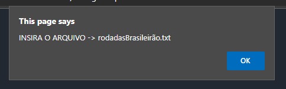
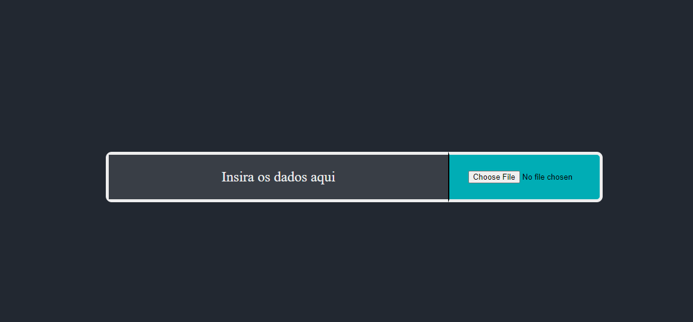

# Projeto Final da Disciplina de Programação Orientada à Obejtos

## 1. Explicação do Projeto e suas funcionalidades.

O projeto tem como objetivo apresentar dados referentes ao campeonato brasileiro de futebol em 2022. 

As linguagens de programação usadas foram: JavaSript e Java.

O usário terá acesso à uma tabela de classificação do campeonato com dados como: pontos, jogos, vitórias, etc. Cada clube terá um botão chamado "Detalhes", que ao ser clicado, apresentará um gráfico do respectivo clube com a posição que ele ocupou em cada rodada. Obs: Neste projeto, foi considerado jogos até a rodada 33 da competição.

O projeto não é somente um apresentador de dados, mas um simulador de jogos. Portanto, caso o usuário queira simular resultados de jogos futuros ou alterar resultados anteriores, é possivel. Apenas é preciso editar/criar um arquivo .txt com formatação fiel ao arquivo "rodadasBrasileirão.txt", enviado junto com a pasta do projeto. Cada linha do arquivo é uma rodada e os jogos de cada rodada são separados por "/".

## 2. Por dentro do código
### 2.1 *Breve explicação*

Os dois códigos apresentam todos os dados e gráficos exatamente com as mesmas informações. Porém, tanto a estética tanto a lógica por trás dos projetos apresentam particularidades que são de certa forma inevitáveis e que serão explicados posteriormente. Contudo, os dois projetos foram desenvolvidos em pleno sincronismo e sempre prezando pela semelhança de pontos cruciais de seu desenvolvimento.

###  2.2 *JavaScript*
##### Autor do código em JavaScript: Vinícius Dias Valença.
### 2.2.1 Antes do código
Com quase nenhum conhecimento da linguagem *JavaScript* e suas companheiras fiéis, *HTML* e *CSS*, decidi encarar o desafio de construir esse projeto.

Alguns foram os motivos para optar por essa decisão, mas o principal foi o fato de ter que aprender essas três tecnologias em um espaço de tempo relativamente curto,além de passar os conhecimentos adquiridos na disciplina de Programação Orientada à Objetos para meu futuro primeiro código em JavaScript.

### 2.2.1 Construção do código

#### **Parte 1**
Após a fase de capturar cada jogo de cada uma das rodadas do campeonato, o desafio foi como ler esse arquivo usando JavaScript. Após pesquisar bastante e testar bastante, decidi tratar a leitura do arquivo de forma separada da tela principal do projeto. Por ter dificuldade com essa parte do projeto optei por esse formato, visando um tratamento mais simples para essa parte do código.

Essa parte se encontra no arquivo "carregarArquivo.html", onde usei uma escrita "inline", ou seja, tanto o *HTML* quanto o *CSS* e o *JavaScript* estão no mesmo arquivo, por ser uma parte simples e inicial do projeto.

Esse código pega cada linha do arquivo e armazena em um array. Após isso, esse array é mandando para um localStorage, visando um acesso posterior desses dados.

```
let rodadas = new Array(33);
for (let r = 0; r < 33; r++) {
    rodadas[r] = new Array(10);
};  
let mudar = 0;
document.getElementById('file').onchange = function(){
    
    let file = this.files[0];
    let reader = new FileReader();
    reader.readAsText(file);
    reader.onload = function(){
        let dadosSTRING = this.result.replace(/\r/g,"").split(/\n/);
        mudar +=1;
        for (let i in dadosSTRING){
            rodadas[i] = (dadosSTRING[i]).split(/,/);
        };
        localStorage.setItem("rodadas",JSON.stringify(rodadas));
        if (mudar != 0){
            window.location.href = "index.html";
        };
        rodadas = [];
    };
};
```

A primeira coisa que acontecerá será esse "alert" na página, pedindo para que o arquivo selecionado seja o "rodadasBrasileirão.txt".



Após clicado em "OK", aperecerá a essa campo abaixo para ser inserido o arquivo contendo as rodadas.



Agora o usário só precisa selecionar o arquivo solicitado e partiremos para a parte principal do projeto.

#### **Parte 2**

Com as rodadas em mãos, os dados podem ser tratados no arquivo "Main.js".


